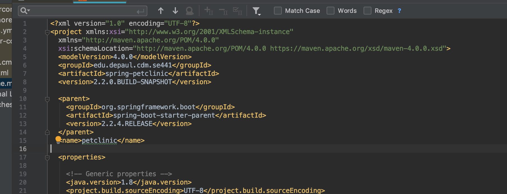
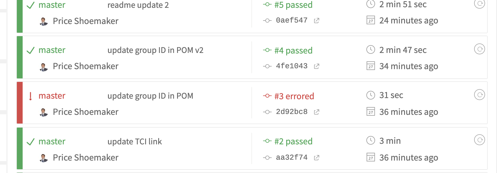
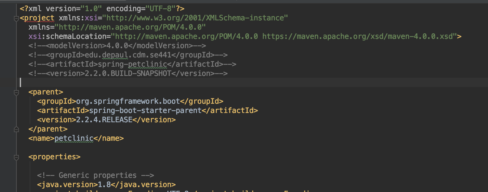
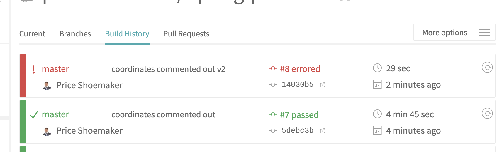
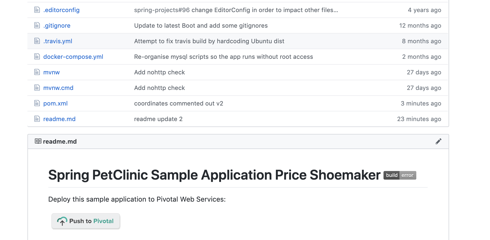
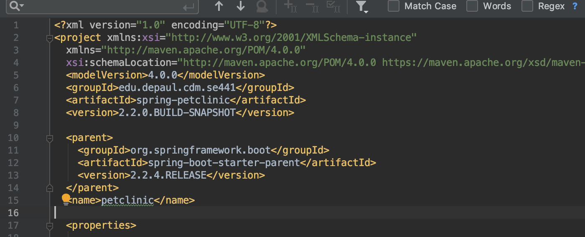
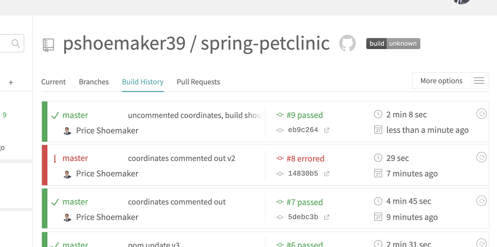

# Instructions

Price Shoemaker PShoema2 SE 441 Spring | Homework 4

**HINT:** Embed your screen captures as requested in the sections below. You can embed the image using the following syntax:

```

```

The first argument is the Alt-text for the image. The second argument is the path to the image. Make sure your images are readable and that you save them in a JPG or PNG format.

## A [5 pts] Your Github account showing that is has been forked from the depaulcdm/springpetclinic repository.


## B [5 pts] Your Travis CI dashboard showing a successful first build.


## C [5 pts] The section of the POM file showing the coordinates after you’ve changed them.



## D [5 pts] Your Travis CI dashboard showing a successful build after your change of the group ID.



## E [5 pts] The section of the POM file showing the coordinates after you’ve commented them out.



## F [5 pts] Your Travis CI dashboard showing the unsuccessful build after the breaking change.



## G [5 pts] Your Github repository with the readme.md file selected showing the build failed status after the Travis CI build fails.



## H [5 pts] The section of the POM file showing the coordinates after you’ve fixed them.



## I [5 pts] Your Travis CI dashboard showing the successful build after the breaking change has been fixed.



## J [5 pts] Your Github repository with the readme.md file

[GitHub Repo](https://github.com/pshoemaker39/spring-petclinic)
